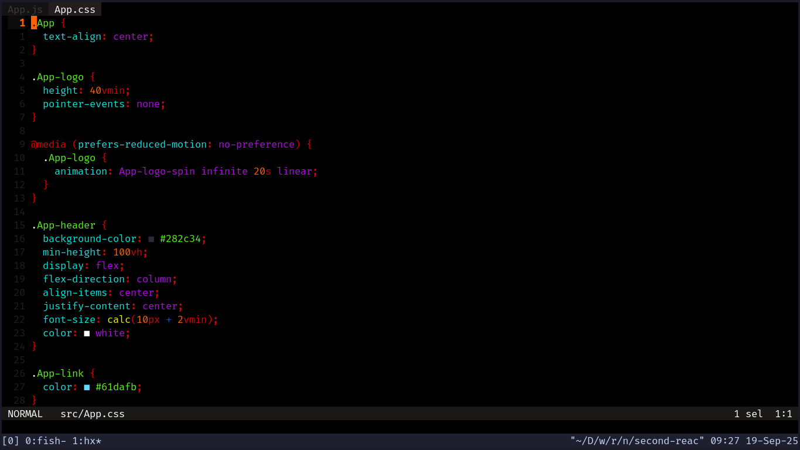
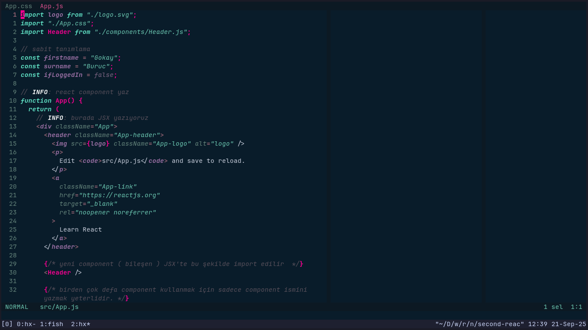

# 🎨 Helix Open Source Themes by gokayburuc

This repository contains various **themes** for the [Helix Editor](https://helix-editor.com), each carefully crafted to provide a beautiful and readable editing experience.

---

## 📁 Theme Index

- [Murmur](./murmur.toml) — A soft, pastel-toned custom theme.
- [Solarized Osaka](./solarized-osaka.toml) — A variant of Solarized with Osaka-inspired hues.
- [NightWolf](./nightwolf.toml) - AMOLED theme for NightWolves
- [LowEyeStrain](./low-eye-strain.toml) - Low Eye Strain Dark Neon Theme For Night Owls
- [NeonCity](./neon-city.toml) - Neon City Theme for Synthwave Lovers
- [EdgeNightSky](./edge-night-sky.toml) - Low Contrast Night Theme for Night Coders 
- [Moxer](./moxer.toml) - Moxer Theme Port Variant from VSCode
- [Strokai](./strokai.toml) - Strokai Theme Port form VSCode
- [Lucy](./lucy.toml) - Cyberpunk Edgerunners' main character Lucyna Kushinada inspired Helix Editor Theme (Palette owner @gokayburuc)
- [Synthwave84](./synthwave84.toml) - Synthwave84 Theme Port from VSCode 
- [Doki](./doki.toml) - Doki Theme Port from VSCode
- [PastelBlack](./pastel-black.toml) - Pastel Black Theme For NightOwls

---

## Screenshots

Murmur:


Solarized Osaka:


NightWolf:


LowEyeStrain:


NeonCity:


EdgeNightSky:


Moxer:


Strokai:


Lucy:


Synthwave84


Doki


Pastel Black


## 🚀 Usage

To use one of these themes in Helix:

1. Copy the desired theme file (e.g. `murmur.toml`) into your Helix themes directory:

   ```bash
   cp murmur.toml ~/.config/helix/themes/
   ```

2. Open Helix and apply the theme with the `:theme` command:

   ```helix
   :theme murmur
   ```

3. To set it as the **default theme**, add the following to your `~/.config/helix/config.toml`:

   ```toml
   theme = "murmur"
   ```

---

## 🌈 Transparent Themes

To create a **transparent** version of any theme:

1. Create a new file in your Helix themes directory, e.g. `murmur-transparent.toml`.
2. Paste the following content:

   ```toml
   inherits = "murmur"

   [ui.background]
   ```

This overrides the background to be transparent while keeping the rest of the theme intact.

---

## 🧊 Contributing

Feel free to fork the repo and create your own themes or submit pull requests to contribute!
If you create your own transparent variant or custom theme, feel free to share it back.
